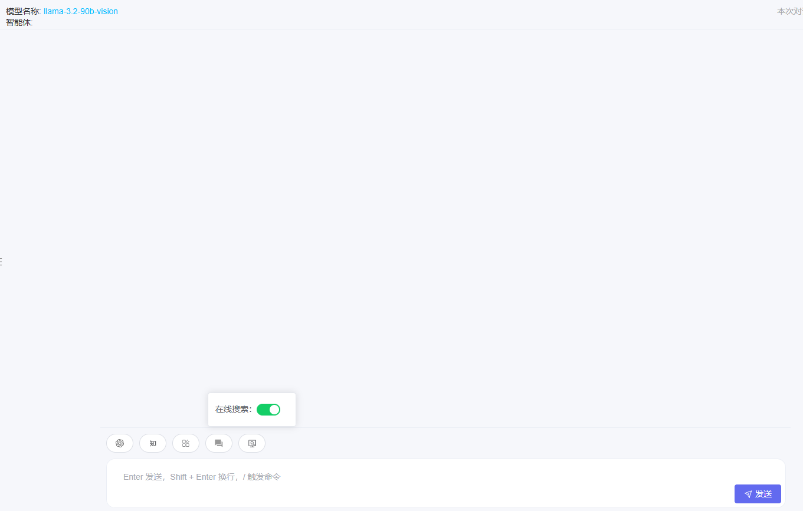

<p align="center">
    <h3>为ChatGPT等多种LLM提供了一个轻快好用的Web图形界面和众多附加功能</h3>
    <p align="center">
      <p>
        支持星火、千问众多模型  · 基于文件问答 · LLM本地部署 · 联网搜索 · Agent 助理 · 
      </p>
    </p>
  </p>

## 目录

* [概述](README.md#概述)
* [功能介绍](README.md#功能介绍)
    * [模型接入](README.md#模型接入)
    * [智能助手](README.md#自定义智能体)
    * [可切换的模型](README.md#可切换的模型)
    * [在线搜索](README.md#在线搜索)
    * [知识库](README.md#知识库)
* [快速上手](README.md#快速上手)
    * [源码安装部署/开发部署](README.md#源码安装部署开发部署)
    * [docker-compose安装部署/开发部署](README.md#docker-compose安装部署开发部署)
* [各大厂商key注册](README.md#厂商key)

## 概述
鉴于当前大多数大型语言模型主要依赖收费的token机制，给用户带来了使用上的不便。本项目应运而生，旨在构建一个免费且易于使用的大型模型系统，基于大模型技术，为用户打造专属的知识库与智能助手，让用户能够更加便捷、高效地获取信息与服务。

 项目图片:


## 功能介绍

### 模型接入
本项目支持多种大型语言模型的接入，包括但不限于
支持 [Groq](https://console.groq.com/playground)、[讯飞星火](https://xinghuo.xfyun.cn/)、[通义千问](https://www.aliyun.com/product/bailian)、[LMStudio](https://lmstudio.ai/)厂商大模型

Groq: 注册后可免费调用
讯飞星火:注册后可免费调用lite大模型
通义千问:首次注册送限定时序的调用token
LMStudio: 提供基于open ai 的接口，带GUI的本地模型调用

这些模型的接入方式简便快捷，无需修改源码即可在页面上配置各种模型。


### 自定义智能体
通过预制的提示词（prompt）和上下文，用户可以轻松打造属于自己的智能助手。


### 可切换的模型
在对话过程中，用户可以随时切换不同的大模型，以获得最佳的响应效果。


### 在线搜索
提供基于网络搜索的工具，给LLM提供更准确的回答


### 知识库
用户可以上传专属文档，构建自己的专有知识库。


## 快速上手
### 源码安装部署/开发部署
#### 0. 拉取项目代码
                                              
如果您希望使用源码启动项目，请直接拉取 master 分支代码：

```shell
git clone https://gitee.com/vfcm/hx_gpt.git
```
#### 1. 初始化开发环境

##### 1.1 安装node.js环境
‌下载Node.js安装包‌：首先，访问[Node.js官网](https:
odejs.org/zh-cn/download/)选择适合您操作系统的版本进行下载。对于Windows系统，通常选择64位的安装包。‌

##### 1.2 安装python环境
python.version >= 3.11.9
安装Python环境：首先，访问[Python官网](https://www.python.org/downloads/)选择适合您操作系统的版本进行下载。

##### 1.3 安装mysql数据库
mysql.version >= 8.0.0
安装mysql数据库：首先，访问[mysql官网](https://dev.mysql.com/downloads/mysql/)选择适合您操作系统的版本进行下载。

```
使用docker启动:

docker run -it --network mysql-network --rm mysql mysql -hsome-mysql -uexample-user -p
```

##### 1.4 安装redis-stack向量数据库
redis-stack.version >= 6.2.6-v17

```
使用docker启动:

$ docker run  -p 6379:6379 -p 8001:8001 redis/redis-stack:latest
```

#### 1.5 安装向量模型
方式一：进入[魔塔社区](https://www.modelscope.cn/home),搜索BAAI/bge-large-zh,然后下载模型文件到本地

```
使用命令行工具下载模型

modelscope download --model 'BAAI/bge-large-zh' --local_dir
'E://bge'
```
方式二：、使用阿里云盘下载模型

链接: https://pan.baidu.com/s/17fV4DHjTqQ5JADE31_EVeg?pwd=6b3i 提取码: 6b3i

下载完成后解压目录到本地
进入BAAI\bge-large-zh的目录中，并记录当前绝对路径

如：E:\plugIn\models\huggingface\sentence-transformers\BAAI\bge-large-zh

#### 2. 启动方式

##### 2.1 前后端分离启动

##### 2.1.1 启动前端项目
进入主项目根目录，打开命令行工具执行以下命令：
````
// 安装依赖包
npm install

// 调试方式启动
npm run dev
````
##### 2.1.1 启动后端项目
进入/server目录下，打开命令行工具执行以下命令：

1、安装虚拟环境，使用venv、conda或者其他包
2、执行pip install -r requirements.txt
3、打开admin\settings.py,找到DATABASES，修改mysql数据库配置
```
DATABASES = {
    "default": {
        "ENGINE": "django.db.backends.mysql",
        "NAME": "ai_agent",
        "USER": "root",  # 数据库用户名
        "PASSWORD": "123456",  # 数据库密码
        "HOST": "localhost",  # 数据库主机地址
        "PORT": "3306",  # 数据库端口号
    }
}
```    
4、打开sql文件夹，运行hx_gpt.sql,初始化数据库

5、执行python manage.py runserver 0.0.0.0:8000 启动项目(允许ip地址访问)

6、打开浏览器访问 http://127.0.0.1:3000

7、点击模型,选择项目配置
配置大模型key和向量的模型路径


##### 2.2 后端一体化启动
##### 2.2.1 打包前端项目
进入主项目根目录，打开命令行工具执行以下命令：
````
// 安装依赖包
npm install

// 前端打包,运行命令后会自动生成web目录
npm run build
````

##### 2.2.2 启动后端项目
1、2、3、4步骤跟[前后端分离-启动后端项目](README.md#####启动后端项目)一致
5、执行python .\manage.py  runserver 启动项目
6、打开浏览器访问 http://127.0.0.1:8000
7、点击模型,选择项目配置
8、配置大模型key和向量的模型路径

## 厂商key

### 讯飞星火(lite模型可免费使用,其他模型送限时token)
[讯飞星火控制台](https://console.xfyun.cn/services/cbm)

### 通义千问(首次注册送限时token)
[阿里百炼控制台](https://bailian.console.aliyun.com/?spm=5176.29619931.J__Z58Z6CX7MY__Ll8p1ZOR.1.74cd59fcPqWd57#/home)

### Groq(注册后可免费使用,限制起上下文)
[Groq注册地址](https://console.groq.com/playground)


## docker-compose安装部署开发部署
### 1. 安装 docker-compose
寻找适合你环境的 docker-compose 版本, 请参考 [Docker-Compose](https://github.com/docker/compose).

举例: Linux X86 环境 可下载 [docker-compose-linux-x86_64](https://github.com/docker/compose/releases/download/v2.27.3/docker-compose-linux-x86_64) 使用.
```shell
cd ~
wget https://github.com/docker/compose/releases/download/v2.27.3/docker-compose-linux-x86_64
mv docker-compose-linux-x86_64 /usr/bin/docker-compose
which docker-compose
```
/usr/bin/docker-compose
```shell
docker-compose -v
```
Docker Compose version v2.27.3
### 2. 创建网络
```shell
docker network create hx_network
```
### 3. 启动项目
```shell
docker-compose up -d
```
打开浏览器访问 http://127.0.0.1:8000
其他配置见[源码安装部署/开发部署](README.md#源码安装部署开发部署)